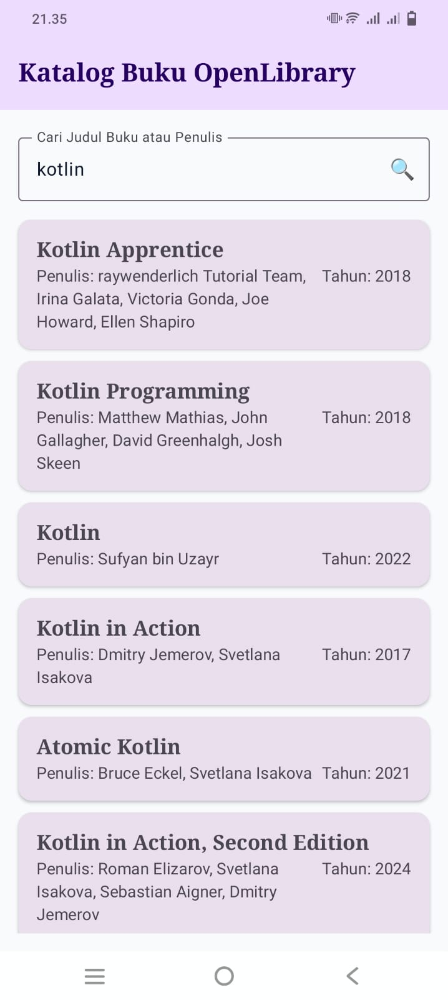
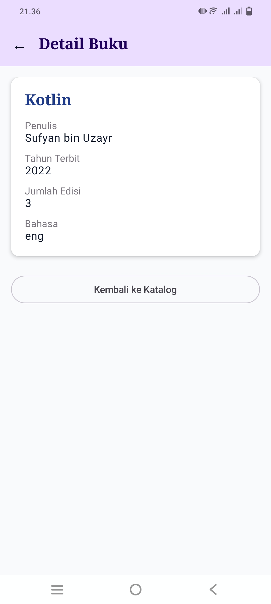

## Identitas

* Nama : Mohammad Dyandra Maliki
* NIM : H1D024130
* Shift Awal & Baru : B / H
* Link Video : https://youtu.be/pE6hV5fBLy4

# Katalog Buku OpenLibrary

Aplikasi Android katalog buku dinamis berbasis **Kotlin** & **Jetpack Compose** dengan arsitektur **MVVM**. Mengonsumsi data dari [OpenLibrary API](https://openlibrary.org/) secara real-time tanpa API Key.

---

## Fitur Utama
- **Pencarian Buku Real-time:** Pencarian buku secara dinamis via query API berdasarkan judul atau penulis.
- **UI State Management:** Penanganan state `Loading`, `Success`, dan `Error` (dilengkapi fitur *Retry*) secara responsif.
- **Daftar Buku Dynamic:** Menampilkan judul, penulis, dan tahun terbit menggunakan `LazyColumn`.
- **Navigasi 2 Layar:**
  - **Home Screen:** Mengelola input pencarian dan daftar buku.
  - **Detail Screen:** Menampilkan informasi rinci buku mencakup judul, penulis, tahun terbit, jumlah edisi, dan bahasa.

---

## Tech Stack & Arsitektur

### Arsitektur (MVVM)
`UI (Compose)` ↔ `ViewModel (StateFlow)` ↔ `Repository` ↔ `Retrofit (API)`
- **`UiState` (Sealed Class):** Handling state `Loading`, `Success`, dan `Error`.

### Dependencies
- **Language & UI:** Kotlin, Jetpack Compose (Material 3)
- **Networking:** `retrofit`, `converter-gson`
- **Navigation & Lifecycle:** `navigation-compose`, `lifecycle-viewmodel-compose`

---

## API Documentation

- **Base URL:** `https://openlibrary.org/`
- **Endpoint:** `GET /search.json?q={keyword}&limit=20` (Tanpa API Key)

---

## Cara Menjalankan
1. Clone repositori & buka di Android Studio.
2. Lakukan **Gradle Sync**.
3. Jalankan aplikasi via **Run ▶️ (Shift + F10)**.

## Display

  
  

